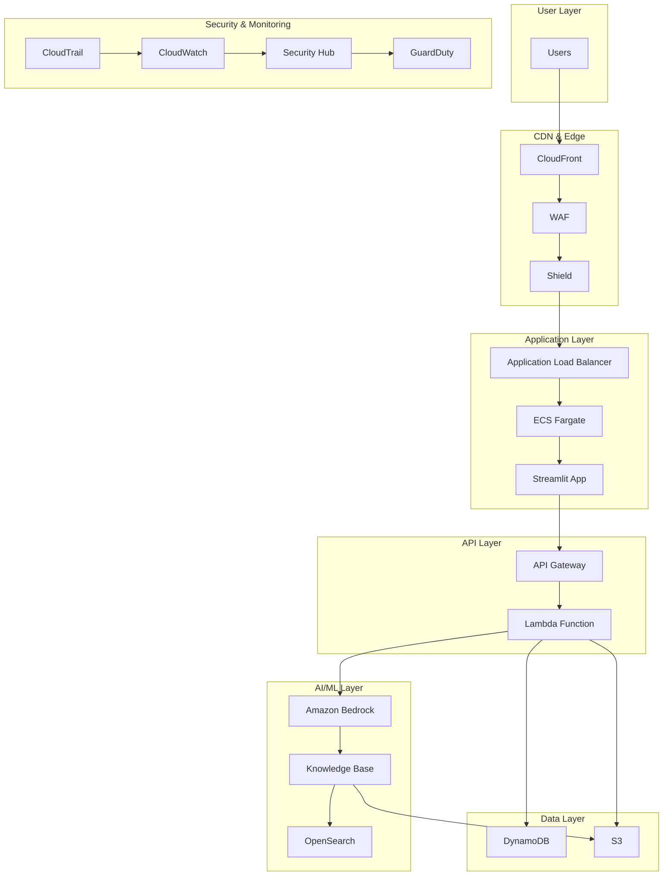
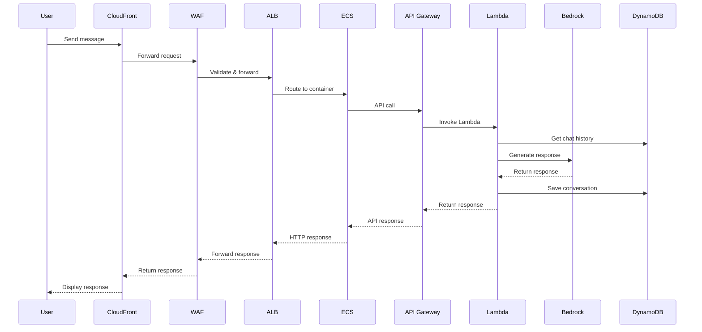
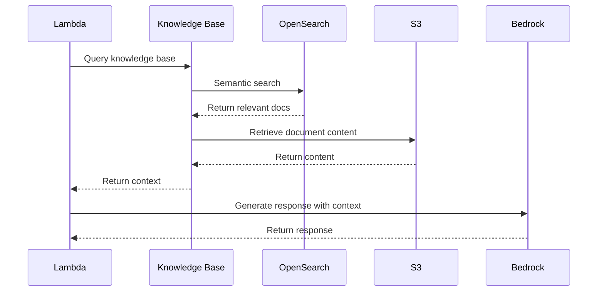

# Architecture Documentation

This document provides a comprehensive overview of the Secure RAG Chatbot architecture, including design decisions, component interactions, and scalability considerations.

## Architecture Overview

The Secure RAG Chatbot implements a microservices architecture on AWS, following the principles of security, scalability, and maintainability. The system is designed to handle conversational AI workloads while maintaining enterprise-grade security standards.

## High-Level Architecture



## Component Details

### 1. Frontend Layer

#### Streamlit Application
- **Technology**: Python 3.11, Streamlit
- **Deployment**: ECS Fargate
- **Features**:
  - Interactive chat interface
  - Real-time messaging
  - Session management
  - Security indicators

#### Key Features
```python
# Security features displayed to users
security_features = [
    "End-to-End Encryption",
    "Input Validation", 
    "Rate Limiting",
    "WAF Protection",
    "VPC Endpoints",
    "IAM Roles",
    "CloudTrail Logging",
    "GuardDuty Monitoring"
]
```

### 2. API Layer

#### API Gateway
- **Type**: REST API
- **Features**:
  - Request/response transformation
  - Rate limiting and throttling
  - CORS configuration
  - WAF integration
  - CloudWatch logging

#### Lambda Function
- **Runtime**: Python 3.11
- **Memory**: 512 MB (configurable)
- **Timeout**: 30 seconds
- **Features**:
  - Input validation and sanitization
  - Context retrieval from knowledge base
  - Response generation via Bedrock
  - Conversation history management

### 3. AI/ML Layer

#### Amazon Bedrock
- **Model**: Claude 3 Sonnet
- **Features**:
  - Text generation
  - Context-aware responses
  - Safety guardrails
  - Model invocation logging

#### Knowledge Base
- **Storage**: OpenSearch Serverless
- **Embeddings**: Amazon Titan
- **Features**:
  - Semantic search
  - Vector similarity
  - Document ingestion
  - Context retrieval

### 4. Data Layer

#### DynamoDB
- **Tables**:
  - Chat history
  - User sessions
  - Application configuration
- **Features**:
  - Encryption at rest
  - Point-in-time recovery
  - Auto-scaling
  - Global secondary indexes

#### S3
- **Buckets**:
  - Document storage
  - Application logs
- **Features**:
  - Versioning
  - Lifecycle policies
  - Encryption
  - Access logging

### 5. Security Layer

#### Network Security
- **VPC**: Isolated network environment
- **Subnets**: Public and private segmentation
- **Security Groups**: Restrictive access rules
- **VPC Endpoints**: Private AWS service access

#### Application Security
- **WAF**: Web application firewall
- **Input Validation**: Comprehensive sanitization
- **Output Encoding**: XSS prevention
- **Rate Limiting**: DDoS protection

#### Data Security
- **Encryption**: At rest and in transit
- **KMS**: Key management service
- **IAM**: Fine-grained access control
- **Secrets Management**: Secure credential storage

## Data Flow

### 1. User Request Flow



### 2. Knowledge Base Retrieval



## Security Architecture

### 1. Defense in Depth

The architecture implements multiple layers of security:

1. **Perimeter Security**: CloudFront, WAF, Shield
2. **Network Security**: VPC, subnets, security groups
3. **Application Security**: Input validation, output encoding
4. **Data Security**: Encryption, access controls
5. **Monitoring Security**: Logging, alerting, threat detection

### 2. Zero Trust Principles

- **Never Trust, Always Verify**: All requests are validated
- **Least Privilege Access**: Minimal required permissions
- **Continuous Monitoring**: Real-time security monitoring
- **Encryption Everywhere**: All data encrypted in transit and at rest

### 3. Compliance and Governance

- **Audit Logging**: Comprehensive audit trails
- **Data Protection**: GDPR, SOC 2 compliance
- **Access Controls**: Role-based access management
- **Incident Response**: Automated alerting and response

## Scalability Design

### 1. Horizontal Scaling

#### ECS Service
- **Auto Scaling**: Based on CPU and memory utilization
- **Load Balancing**: Application Load Balancer distribution
- **Container Orchestration**: ECS Fargate managed containers

#### Lambda Function
- **Concurrency**: Automatic scaling based on demand
- **Reserved Concurrency**: Configurable limits
- **Provisioned Concurrency**: For predictable workloads

#### API Gateway
- **Throttling**: Rate limiting and burst control
- **Caching**: Response caching for improved performance
- **Regional Distribution**: Multi-region deployment support

### 2. Vertical Scaling

#### Resource Optimization
- **ECS Tasks**: CPU and memory allocation
- **Lambda**: Memory and timeout configuration
- **OpenSearch**: Instance types and storage
- **DynamoDB**: Read and write capacity units

### 3. Performance Optimization

#### Caching Strategy
- **CloudFront**: Global content delivery
- **API Gateway**: Response caching
- **Application**: In-memory caching
- **Database**: Query result caching

#### Database Optimization
- **DynamoDB**: Global secondary indexes
- **OpenSearch**: Index optimization
- **S3**: Intelligent tiering

## Monitoring and Observability

### 1. Application Monitoring

#### CloudWatch Metrics
- **Lambda**: Invocations, errors, duration
- **ECS**: CPU, memory, task count
- **API Gateway**: Request count, latency, errors
- **DynamoDB**: Read/write capacity, throttling

#### Custom Metrics
- **User Engagement**: Session duration, message count
- **AI Performance**: Response time, accuracy
- **Security Events**: Failed attempts, anomalies

### 2. Security Monitoring

#### Security Hub
- **Centralized Findings**: Security posture overview
- **Compliance Checks**: Automated compliance monitoring
- **Threat Detection**: Security event correlation

#### GuardDuty
- **Threat Intelligence**: Malicious activity detection
- **Anomaly Detection**: Unusual behavior identification
- **Incident Response**: Automated threat response

### 3. Logging and Audit

#### CloudTrail
- **API Calls**: All AWS service interactions
- **User Activity**: Authentication and authorization
- **Resource Changes**: Infrastructure modifications

#### Application Logs
- **Structured Logging**: JSON-formatted logs
- **Log Aggregation**: Centralized log collection
- **Log Analysis**: Real-time log processing

## Disaster Recovery

### 1. Backup Strategy

#### Data Backup
- **DynamoDB**: Point-in-time recovery
- **S3**: Cross-region replication
- **Application Code**: Git repository
- **Configuration**: Infrastructure as Code

#### Recovery Procedures
- **RTO**: Recovery Time Objective < 4 hours
- **RPO**: Recovery Point Objective < 1 hour
- **Testing**: Regular disaster recovery drills

### 2. High Availability

#### Multi-AZ Deployment
- **ECS Tasks**: Distributed across availability zones
- **DynamoDB**: Multi-AZ replication
- **OpenSearch**: Multi-AZ cluster
- **Load Balancer**: Cross-AZ distribution

#### Failover Mechanisms
- **Automatic Failover**: Health check-based
- **Manual Failover**: Controlled failover procedures
- **Rollback Capability**: Quick rollback to previous version

## Cost Optimization

### 1. Resource Optimization

#### Right-Sizing
- **ECS Tasks**: Optimal CPU/memory allocation
- **Lambda**: Memory and timeout tuning
- **OpenSearch**: Instance type selection
- **DynamoDB**: Capacity unit optimization

#### Reserved Capacity
- **ECS**: Reserved instances for predictable workloads
- **DynamoDB**: Reserved capacity for consistent usage
- **OpenSearch**: Reserved instances for production

### 2. Cost Monitoring

#### Cost Allocation
- **Tags**: Resource tagging for cost tracking
- **Budgets**: Cost alerts and limits
- **Reports**: Detailed cost analysis
- **Optimization**: Cost optimization recommendations

## Future Enhancements

### 1. Planned Features

#### AI/ML Improvements
- **Multi-Modal Support**: Image and document processing
- **Custom Models**: Fine-tuned models for specific use cases
- **Advanced RAG**: Improved context retrieval
- **Real-Time Learning**: Continuous model improvement

#### Security Enhancements
- **Zero Trust Network**: Advanced network segmentation
- **Behavioral Analytics**: User behavior analysis
- **Threat Intelligence**: External threat feeds
- **Automated Response**: Self-healing security

### 2. Technology Evolution

#### Emerging Technologies
- **Serverless Containers**: AWS Fargate Spot
- **Edge Computing**: Lambda@Edge
- **Quantum-Safe Cryptography**: Future-proof encryption
- **AI Governance**: Responsible AI frameworks

## Conclusion

The Secure RAG Chatbot architecture provides a robust, scalable, and secure foundation for conversational AI applications. The design emphasizes security, performance, and maintainability while following AWS best practices and industry standards.

Key strengths of the architecture:
- **Security-First Design**: Comprehensive security controls
- **Scalable Infrastructure**: Auto-scaling and performance optimization
- **Observability**: Comprehensive monitoring and logging
- **Maintainability**: Infrastructure as Code and automated deployments
- **Compliance**: Built-in compliance and governance features

This architecture serves as a blueprint for secure, enterprise-grade AI applications and can be adapted for various use cases and requirements.
